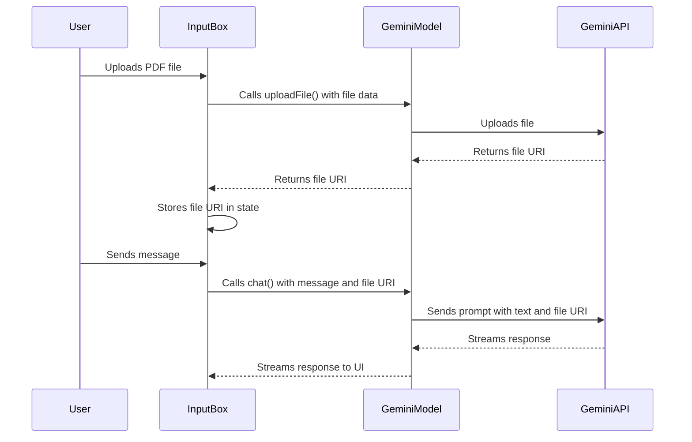

# Gemini PDF Upload Implementation Plan

This document outlines the detailed plan for integrating PDF file uploads with the Gemini API in the "super-chatbox" application.

## 1. Goal

The primary objective is to allow users to upload PDF files when using a Gemini model. These files will be sent to the Gemini API and included in the context of the conversation, enabling more accurate and context-aware responses.

## 2. Architecture Overview

The implementation will follow the existing modular architecture of the application, ensuring that the new functionality is well-integrated and maintainable. The changes will be concentrated in the following areas:

*   **Core Data Structures:** Extending the `Message` type to support file attachments.
*   **Gemini Model:** Adding a new method to handle file uploads to the Gemini Files API.
*   **Abstract Model:** Modifying the message conversion logic to include file data.
*   **UI Component:** Updating the `InputBox` component to orchestrate the file upload and message submission process.

## 3. Detailed Implementation Steps

### Step 1: Update Core Data Structures

**File:** [`src/shared/types.ts`](src/shared/types.ts:0)

**Task:** Introduce a new `MessageFilePart` type to handle file attachments.

1.  **Define `MessageFilePart`:**
    *   Create a new type `MessageFilePart` with the following properties:
        *   `type`: A literal type set to `'file'`.
        *   `file`: The `File` object to be uploaded.
        *   `mimeType`: The MIME type of the file (e.g., `application/pdf`).
        *   `uri?`: An optional string to store the URI returned by the Gemini API after a successful upload.

2.  **Update `MessageContentParts`:**
    *   Add `MessageFilePart` to the `MessageContentParts` union type to allow file attachments to be included in messages.

### Step 2: Implement the `uploadFile` Method

**File:** [`src/renderer/packages/models/gemini.ts`](src/renderer/packages/models/gemini.ts:0)

**Task:** Add a new `uploadFile` method to the `Gemeni` class to handle file uploads.

1.  **Define the `uploadFile` Method:**
    *   Create a new public method `uploadFile(file: File): Promise<string>`.
    *   This method will be responsible for sending the file to the Gemini Files API.

2.  **Implement the API Request:**
    *   Use the `apiRequest` utility to make a `POST` request to the Gemini Files API endpoint.
    *   The request body should contain the file data.
    *   The request headers should include the `Content-Type` of the file and the Gemini API key.

3.  **Handle the API Response:**
    *   Parse the JSON response from the API to extract the file URI.
    *   Return the URI as a string.
    *   Implement error handling to manage any issues that may occur during the upload process.

### Step 3: Update Message Conversion Logic

**File:** [`src/renderer/packages/models/abstract-ai-sdk.ts`](src/renderer/packages/models/abstract-ai-sdk.ts:0)

**Task:** Modify the `convertToCoreMessages` function to handle the new `MessageFilePart`.

1.  **Update `convertContentParts`:**
    *   Add a new case to the `if/else` block to handle `MessageFilePart`.
    *   When a `MessageFilePart` is encountered, read the file data as a `Buffer`.
    *   Create a `FilePart` object with the file data and `mimeType`.
    *   Return the `FilePart` object.

2.  **Update `convertToCoreMessages`:**
    *   No changes are needed here, as the `convertContentParts` function will now handle the file parts correctly.

### Step 4: Enhance the `InputBox` Component

**File:** [`src/renderer/components/InputBox.tsx`](src/renderer/components/InputBox.tsx:0)

**Task:** Update the `handleSubmit` function to manage file uploads before submitting the message.

1.  **Modify `handleSubmit`:**
    *   Before submitting the message, check if there are any file attachments in the `attachments` state.
    *   If there are, iterate over the files and call the `uploadFile` method from the `Gemeni` model for each one.
    *   Store the returned URIs in a new state variable.

2.  **Update the Payload:**
    *   When calling the `onSubmit` function, include the array of file URIs in the payload.

3.  **Clear Attachments:**
    *   After a successful submission, clear the `attachments` and file URI state variables.

## 4. Mermaid Diagram

This detailed plan provides a comprehensive roadmap for implementing the PDF upload functionality. It ensures that the new feature is built upon the existing architecture in a clean and maintainable way.